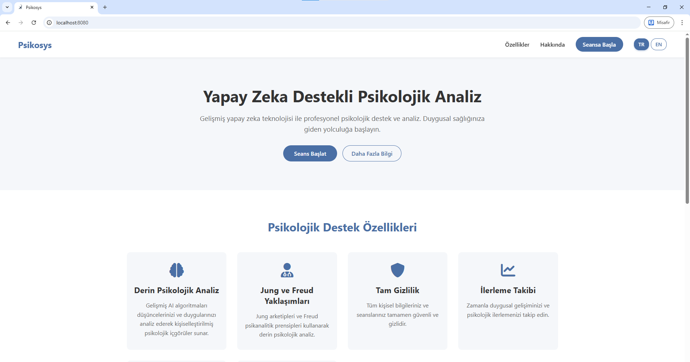
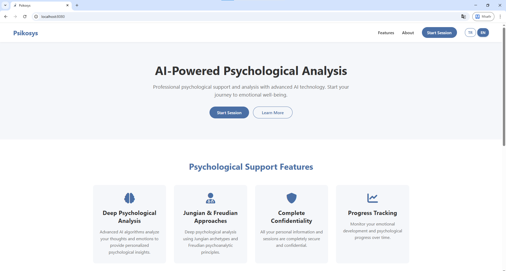
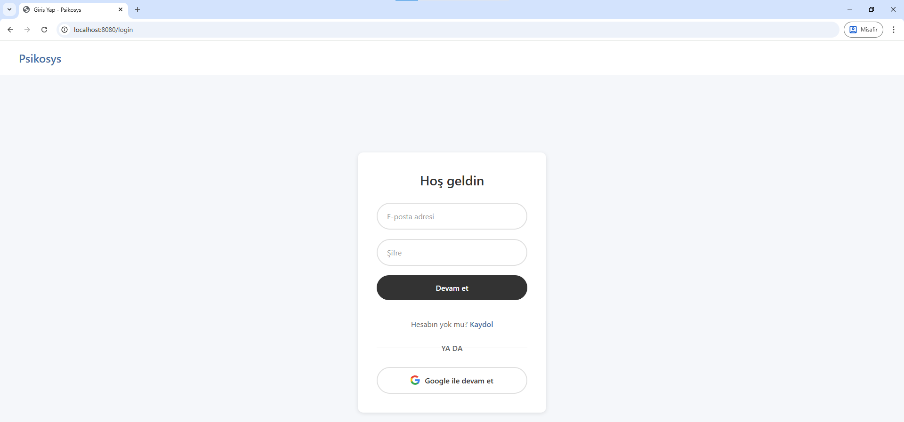
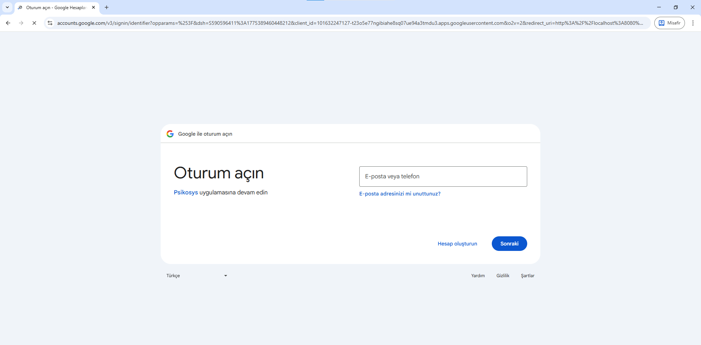
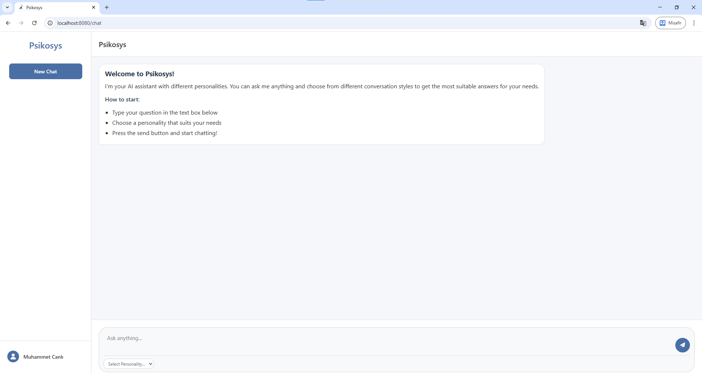
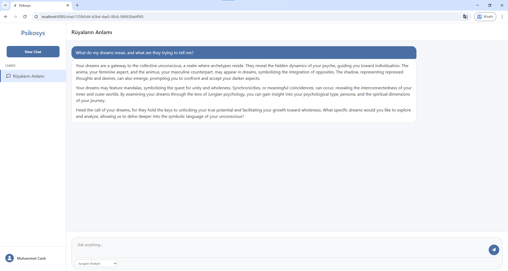
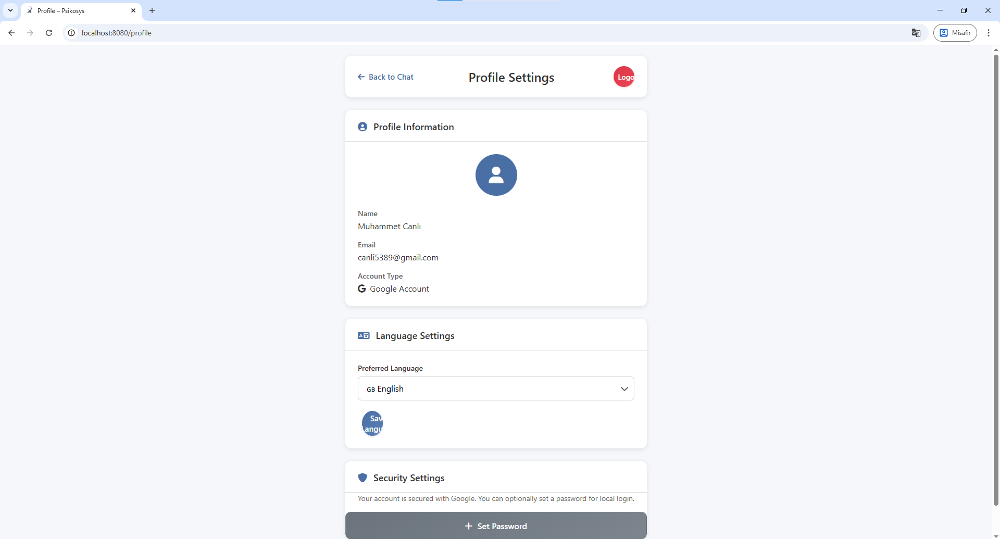

# Psikosys

[](https://www.oracle.com/java/)
[](https://spring.io/projects/spring-boot)
[](https://maven.apache.org/)
[](https://www.mysql.com/)
[](https://www.thymeleaf.org/)
[](https://spring.io/projects/spring-security)

Psikosys is a Spring Boot web application that combines AI-powered chat, Jungian-Freudian style personality prompting, and secure account management (form login + Google OAuth2).

## Features

- Personality-based AI chat experience
- Multi-language support (`tr` / `en`) with cookie + profile preference sync
- User registration and login with Spring Security
- Google OAuth2 authentication support
- Chat history and personality selection per conversation
- Profile management (language and password updates)

## Tech Stack

- Java 21
- Spring Boot 3.4.3
- Spring Web, Spring Security, Spring Data JPA, Thymeleaf
- Spring AI (OpenAI-compatible API via Groq)
- MySQL
- Maven

## Prerequisites

- JDK 21
- MySQL 8+
- Maven (or Maven Wrapper)

## Setup

### 1) Database setup

Create a MySQL database named `psikosys`.

Make sure your datasource settings in `src/main/resources/application.properties` match your local MySQL credentials.

### 2) Environment variables (`.env`)

Create a `.env` file in project root (same level as `pom.xml`):


```dotenv
SPRING_AI_OPENAI_API_KEY=your_api_key_here
SPRING_AI_OPENAI_BASE_URL=https://api.groq.com/openai
SPRING_AI_OPENAI_CHAT_OPTIONS_MODEL=llama-3.3-70b-versatile

GOOGLE_AUTH_CLIENT_ID=your_google_client_id
GOOGLE_AUTH_CLIENT_SECRET=your_google_client_secret
GOOGLE_AUTH_CLIENT_URI=http://localhost:8080/login/oauth2/code/google
```

> `application.properties` already imports `.env` via `spring.config.import=optional:file:.env`.

### 3) Run the application

#### Windows (PowerShell)

```powershell
.\mvnw.cmd spring-boot:run
```

#### macOS/Linux

```bash
./mvnw spring-boot:run
```

App URL:

- `http://localhost:8080`

## Run Tests

### Windows (PowerShell)

```powershell
.\mvnw.cmd test
```

### macOS/Linux

```bash
./mvnw test
```

## Important Routes

### UI routes

- `GET /` -> landing page
- `GET /login` -> login page
- `GET /register` -> register page
- `GET /chat` -> chat page
- `GET /profile` -> user profile

### API routes

- `GET /api/ai/generate?message=...`
- `GET /api/ai/generateStream?message=...`
- `GET /api/personalities`
- `GET /api/debug/token`

## Screenshots









## Project Structure

```text
src/main/java/com/atlas/Psikosys
  configuration/
  controller/
  dto/
  entity/
  repository/
  security/
  service/

src/main/resources
  static/
  templates/
  personalities.json
  personalities-tr.json
  personalities-en.json
  application.properties
```

## Security Note

- Do not commit real API keys or OAuth secrets.
- Keep `.env` local and rotate keys if accidentally exposed.

## License

Add your preferred license here (MIT, Apache-2.0, etc.).

